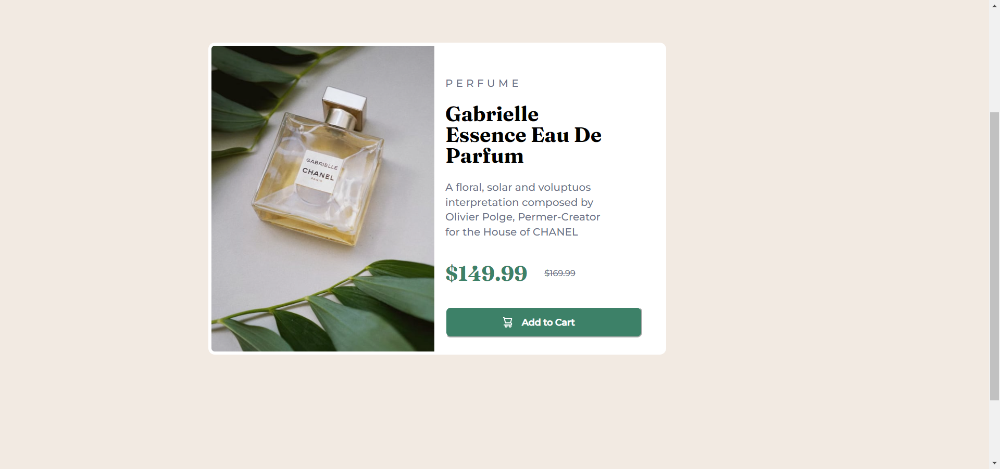

# Frontend Mentor - Product preview card component solution

This is a solution to the [Product preview card component challenge on Frontend Mentor](https://www.frontendmentor.io/challenges/product-preview-card-component-GO7UmttRfa). Frontend Mentor challenges help you improve your coding skills by building realistic projects. 

## Table of contents

- [Overview](#overview)
  - [The challenge](#the-challenge)
  - [Screenshot](#screenshot)
  - [Links](#links)
- [My process](#my-process)
  - [Built with](#built-with)
  - [What I learned](#what-i-learned)
  - [Continued development](#continued-development)
  - [Useful resources](#useful-resources)
- [Author](#author)
- [Acknowledgments](#acknowledgments)

## Overview

### The challenge

Users should be able to:

- View the optimal layout depending on their device's screen size
- See hover and focus states for interactive elements

### Screenshot



### Links

- Solution URL: [Github Repository]https://github.com/fikzta/Product-Preview-Card)
- Live Site URL: [Github Page](https://fikzta.github.io/Product-Preview-Card/)

## My process

### Built with

- Semantic HTML5 markup
- CSS custom properties
- Flexbox

### What I learned

To see how you can add code snippets, see below:

```html
<h1>Some HTML code I'm proud of</h1>
```

-It feels rewarding to figure this button feature since i was stuck for a couple days, taking breaks, researching, until it finally clicked!
```css
.button-container {
    display: flex;
    cursor: pointer;
    width: 100%;
    flex-direction: row;
    /* justify-content: space-evenly; */
    align-items: center;
    background-color: #3d8168;
    border-radius: 8px;
    border-color: white;
    box-shadow: none;
    padding: 1em 1.5em 1em 0em;
}

.cart-icon {
    width: 15px;
    margin-left: 6.5em;
}

.button-text {
    font-family: 'Montserrat', sans-serif;
    font-size: 14px;
    font-weight: 700;
    color: #FFFF;
    margin-left: 1em;
}
```
-The product img is quite a challenge because i want to fill the container just
```css
.container {
    display: flex;
    width: 80%;
    /* border: 5px solid white; It turns out this border was holding back the product img to completely fill around the border using object fit cover so i just had to turn it off. */
    border-radius: 10px;
    padding: 0%;
    background-color: white;
    overflow: hidden;
}

.product-image {
    /* border: 2px solid black; */
    /* position: relative; */
    /* overflow: hidden; */
    /* object-fit: cover; */
}

.perfume-picture {
    /* border: 2px solid black; */
    width: 100%;
    /* object-fit: cover; */
    /* height: 110%; */
    transform: scale(1.2);
    /* margin: -10%; */
    /* padding: -20%; */
    /* overflow: auto; */
    /* position: absolute; */
    
}
```
### Continued development

- I'm still in the early stages of my web development and one thing i realized is that it's all about the little things that i need to implement. IE. Spacing between elements, aligning elements, filling element to fit container. but I'm thankful to frontend mentor's challenges because it builds confidence to build projects.

### Useful resources

- [Resource 1](https://www.geeksforgeeks.org/how-to-auto-resize-an-image-to-fit-a-div-container-using-css/) - This helped me for bringing product img close to container as close as possible. I'm still figuring out how to fill img to container fully.
- [Resource 2](https://stackoverflow.com/questions/34891559/image-and-text-in-a-single-line-in-button-via-css-without-float) - This thread helped me figure out the spacing for button on the project. Especially the spacing, like margins, ems, etc. I'd recommend it to anyone still learning this concept.

## Author

- Github - [@fikzta](https://github.com/fikzta)
- Frontend Mentor - [fikzta](https://www.frontendmentor.io/profile/fikzta)
- Twitter - [@fikzta09](https://twitter.com/fikzta09)


## Acknowledgments

